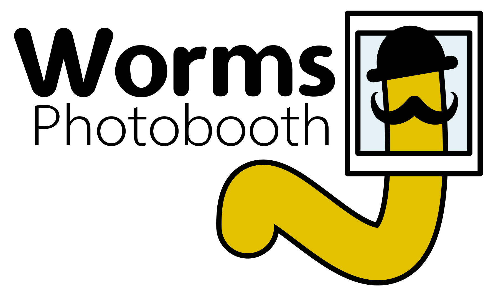
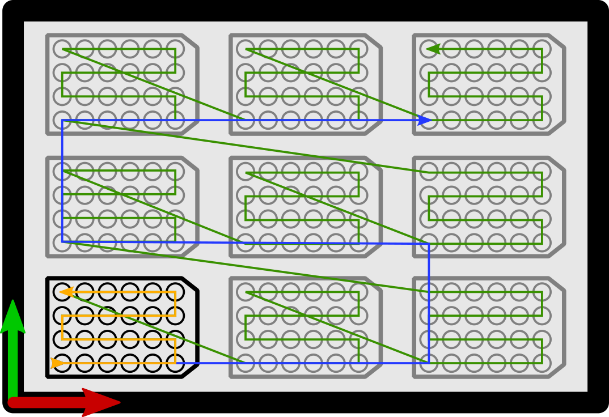

# M2_CIML_Automated-image-capture  
## Project abstract
Applicant: Jérôme Belougne  
Institute: CIML  
Engineer: Mathias Lechelon  
Submission date: 15/07/2020  
Summary : <em>Optimize the automation of the image capture already present ( DMS300 / Workstation Tecan gemini).
The aim of the optimization will be to replace the currently used automaton with an X-Y automated platform system.
Create a plexiglass enclosure to control the environment (humidity, temperature) around the camera and the X-Y platform.
Optimize the imaging instrument, to obtain higher quality images.</em>
  
## How it works
This program aims to track worms (*C.Elegans*) in wells plates, placed inside a CNC router frame. The plates are fixed, and the camera move above/below (depending on the preferences) each well to take a picture. This is repeated n times.

## Command Line Interface (CLI), and how to use it
The file is refered as cli.py in the RaspberryPi folder.  
Steps:  
* Open the terminal (LXTerminal);  
* Change directory to go into the RaspberryPi folder, where the cli.py file is located.  
    ```cd Desktop/M2_CIML_Automated-image-capture/RaspberryPi/```
* To start the scan with default parameter (12 wells boxes, 30 min of delay, 48 hours long):
    ```python cli.py```
    Options:
    * ```--box``` to define the type of box (available options : 6, 12);
        * *Example to use 12 wells boxes: ```python cli.py --box 6```*
    * ```--delay``` to define the delay between each scan. With format hh:mm:ss.
        * *Example to set a 50 min delay: 00:50:00: ```python cli.py --delay 00:50:00```*
    * ```--duration``` to define the total duration of the experiment. With format hh:mm:ss.
        * *Example to set a 24 hours long experiment: ```python cli.py --duration 24:00:00```
    * *Example to set an experiment with 6 wells boxes, with 40 minutes delay, and a total duration of 36 hours: ```python cli.py --box 6 --delay 00:40:00 --duration 36:00:00```.
* Once you type *Enter* a resume of the selected parameters appears. You can type *y* (for yes) if you want to run the scan with the selected parameters. Or type *n* (for no) to abort the scan.
* To cancel a scan, hold *ctrl+c*.

## Electronics

Make sure the stepper motors are correctly plugged to the CNC shield. Help here : https://www.youtube.com/watch?v=bR3853iNaW8. *Use a LED plugged into the stepper motor wires, and check when it lights up. Connect the 2 pins that were used to light the LED beside each other on the CNC shield A4988 driver. For example on 1B and 1A. Then check that the 2 other pins make the LED to light up, and connect them to the other A4988 pin 2A and 2B. Considering A4988 pins to be 1B-1A-2B-2A.*

## XY stage (different size)
* Setepper motor : 42BYGH34H-2A-23D (Nema 17 2A ?)
* GT2-20 – Poulie 20 dents en Aluminium, pour axe de 5mm (3 x) - 4.8€
    * https://diydomo.com/boutique/impression-3d/mecanique/2gt-20-poulie-20-dents-en-aluminium-pour-axe-de-5mm/
* Courroie GT2 6mm de large pas de 2mm au mètre () - 2,95€
    * https://diydomo.com/boutique/impression-3d/mecanique/courroie-gt2-6mm-de-large-pas-de-2mm-au-metre/
* Interrupteur Inverseur fin de course 1A 125VAC pour imprimante 3D (4 x) - 2.4€
    * https://diydomo.com/boutique/impression-3d/electronique/interrupteur-inverseur-fin-de-course-1a-125vac-pour-imprimante-3d/
* Profile aluminium 30x60 B-type rainure 8 (2 x 500 mm) - 12.18€
    * https://www.motedis.fr/shop/Profile-a-rainures/Profile-30-B-Type-rainure-8/Profile-aluminium-30x60-B-Typ-rainure-8::99999436.html
* Profilé aluminium 30x30 B-Typ rainure 8 (2 x 500 mm) - 5.24€
    * https://www.motedis.fr/shop/Profile-a-rainures/Profile-30-B-Type-rainure-8/Profile-aluminium-30x30-B-Typ-rainure-8::99999432.html
* Profilé aluminium 30x60 B-Typ rainure 8 (1 x 484 mm) - 6,44 €
    * https://www.motedis.fr/shop/Profile-a-rainures/Profile-30-B-Type-rainure-8/Profile-aluminium-30x60-B-Typ-rainure-8::99999436.html
* Équerre d'assemblage 30 B-Typ (4 x avec jeu de fixation) - 6,0145 €
    * https://www.motedis.fr/shop/Profile-accessoires/Bracket-for-Aluminium-profiles/Equerre-dassemblage-30-B-Typ::999991057.html
* Ecrous à tête marteau R8 B-Typ [M6] (1 x 50 pcs) - 7,2639 €
    * https://www.motedis.fr/shop/Profile-accessoires/Dans-la-rainure/Ecrous-a-tete-marteau-R8-B-Typ-M6::999994215.html
* Roue caoutchouc Creality3D CR-10S PRO (12 x ) - 30.36 €
    * https://www.makershop.fr/pieces-detachees/3046-roue-caoutchouc-cr-10s-pro.html?search_query=roue&results=25
    * https://www.conrad.fr/p/roulement-a-billes-radial-ubc-bearing-625-2z-5-mm-exterieur-16-mm-regime-max-36000-trmin-198818
* Vis
    * pour stepper (x 12): M3, 12 mm
    * pour attacher les courroies (x 6): M6, 12 mm
    * pour filetage du profilé (x 16) : M8, 12 mm
    * pour attacher le moteur de l'axe Y (x 4) : M5, 50 mm
    * pour attacher les roues de l'axe X (x 8) : M5, 30 mm


## Issues
* To be able to take picture at a maximal resolution:
    * ```sudo raspi-config``` > Performance Options > GPU memory > 256

## Yet to do
* Add STOP button
* Add 2 new endstops at the end of the axis
* Add a filter for the endstops
* config.py to json
* ~~Placing the end stops on the frame, on each axis;~~
* ~~Defining the bottom left well as the zero position.~~
* ~~Move arg_def(from functions.py) into cli.py~~
* Write a small user guide for the cli into readme
* Update the scheme below with the current path
* Make a scheme for electronics
* ~~Add the config.h file with modification for grbl~~

